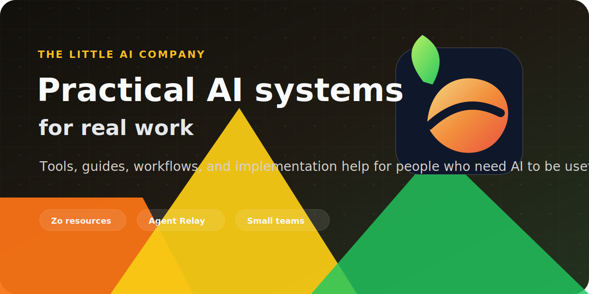

# The Little AI Company

The Little AI Company builds practical AI resources, workflows, and tools for people who need AI to help with real work.

We care less about hype and more about usable systems: clear guides, repeatable workflows, reliable handoffs, and tools that make complicated work easier to run.

The company owl, downloadable marks, and usage guidance live in the
[organization brand kit](../brand/BRAND.md).

## Start Here

| Link | What to look for |
| --- | --- |
| [**Website**](https://littleaicompany.com) | Public company surface and current positioning. |
| [**Zo Computer 101**](https://github.com/The-Little-AI-Company/zo-computer-101) | Searchable field-guide site for learning and using Zo Computer. |
| [**Zo Computer 101 Guides**](https://github.com/The-Little-AI-Company/zo-computer-101-guides) | Markdown guide library behind the Zo Computer 101 site. |
| [**Zo Cookbook**](https://github.com/The-Little-AI-Company/zo-cookbook-app) | App, space, automation, and prompt recipes for Zo Computer users. |
| [**Open Work Relay**](https://github.com/The-Little-AI-Company/open-work-relay) | Open handoff protocol for moving work across AI agents, queues, and people. |

## What We Build

- Beginner-friendly AI guides and learning resources.
- Practical workflows for small teams, operators, and solo builders.
- Agent handoff and coordination patterns.
- Proof-first public tools and documentation.
- Systems that make AI useful without making people learn a pile of jargon first.
