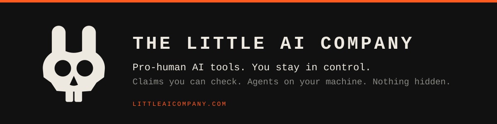

# The Little AI Company

Pro-human AI tools. You stay in control, and you keep learning.

We build small tools that keep a person in charge of the AI they use. Memory
lives in files you can open. Claims come with the sources behind them. Nothing
runs that you can't see, stop, or undo.

    

## Tools

| Tool | What it does | Status |
| --- | --- | --- |
| [Callout](https://github.com/The-Little-AI-Company/callout) | Press a hotkey over anything you're reading. A small popover tells you whether the text is trying to manipulate you, and whether its claims hold up against sources it fetched. Windows tray app. Bring your own keys. No server, no account, no telemetry. | Private beta. Windows only. |
| [Vivary](https://github.com/vivary-dev/vivary) | Typed memory, search, and human gates for AI-agent workspaces, kept as plain Markdown files you can read and diff. One command scaffolds a workspace. | In development. Scaffolder published on npm and PyPI. |

Callout is a joint product with [Wazoo](https://wazoo.dev).

## What we hold to

- **You decide.** The tool proposes and you approve. A human gate is a feature,
  not a speed bump.
- **You can read everything.** State is plain files on your machine, not a
  hosted store you can't open.
- **You keep learning.** A tool that thinks for you leaves you weaker. Ours show
  their work so you get sharper.
- **Sources or silence.** Every claim carries where it came from. Unsure is a
  real answer.

## Elsewhere

Jeff Kazzee's guides and workshops on second brains and Zo Computer live on his
own account at [Jeff-Kazzee](https://github.com/Jeff-Kazzee). This organization
holds the software.

## Contact

[littleaicompany.com](https://littleaicompany.com)
